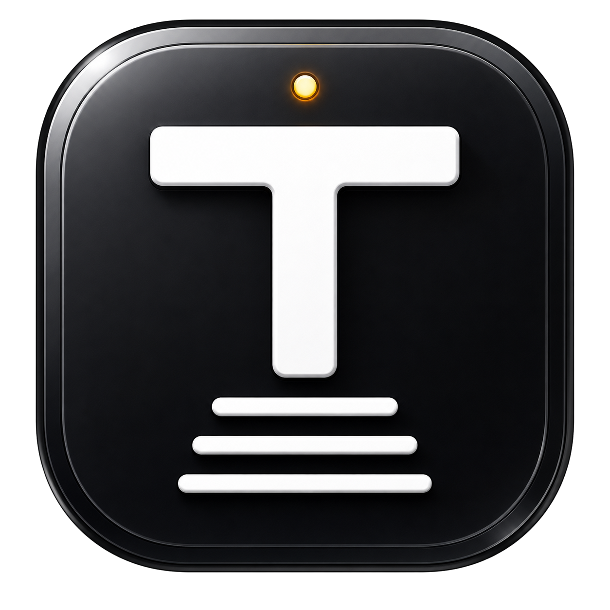
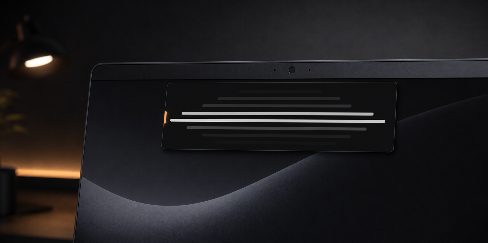
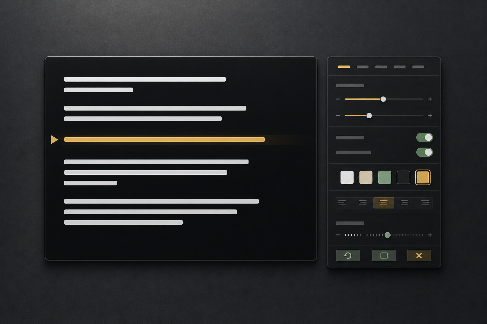

<p align="center">
  
</p>

<h1 align="center">TELEPROMTR</h1>

<p align="center">
  A tiny, offline, frameless teleprompter for creators who want the script right beside the webcam.
</p>

<p align="center">
  
</p>

## Why This Exists

Most teleprompters feel bigger than the job. TELEPROMTR is designed to be a small, polished reading surface: black background, white text, almost no edge padding, no header bar, and the controls tucked away until you right click.

The first target is a portable Windows desktop app, with an Android build scaffolded through Capacitor. The prompting surfaces are kept web-native on purpose, so desktop, mobile, and future PWA work can share the same product language without dragging platform-only code through the UI.

## The Shape

| Principle | What it means |
| --- | --- |
| Invisible by default | The main window is the product: no toolbar, no title bar, no chrome. |
| Directly editable | Click into the floating window and write like a tiny script editor. |
| Powerful when needed | Desktop settings are grouped behind right click; mobile settings live in a bottom sheet. |
| Offline always | Current script and settings autosave locally in app data. No accounts, no telemetry. |
| Portable first | Run it from a folder today; keep the renderer adaptable for other platforms later. |

<p align="center">
  
</p>

## Run It

```powershell
npm install
npm start
```

## Package Windows

```powershell
npm run package:win:portable
```

The standalone Windows exe is written to `release/artifacts/`. It shows a small startup banner on first launch while it unpacks the app, then reuses the cached app folder on later launches.

Unsigned Windows builds can still show Microsoft Defender SmartScreen until the app is distributed through the Microsoft Store or signed with a publisher identity that earns reputation.

## Android

The Android app uses a mobile-specific fullscreen surface:

- black background mode
- selfie-camera background mode
- obsidian teleprompter box near the top of the screen
- bottom controls for play, camera mode, and settings
- camera-plus-mic recording with native sharing
- local autosave, no network permission

Prepare the Android project:

```powershell
npm run android:sync
```

Build a debug APK after installing Android Studio or a JDK/Android SDK toolchain:

```powershell
npm run apk:debug
```

The debug APK is written to `release/artifacts/`.

## Controls

| Action | Control |
| --- | --- |
| Edit | Single click in the window |
| Move | Click, hold, and drag |
| Settings | Right click |
| Leave edit focus | `Escape` |
| Play or pause | `Space` when not editing, or `Ctrl+Enter` anywhere |
| Manual scroll | `ArrowUp` / `ArrowDown` when not editing |

## Project Layout

```text
src/
  main/      Electron window, local persistence, import/export
  preload/   Narrow bridge between Electron and the renderer
  renderer/  Portable teleprompter UI
  menu/      Floating desktop settings panel
  mobile/    Android/mobile prompting surface
android/     Capacitor Android project
assets/
  app/       App icons for desktop and Android
  readme/    Stable visual assets for this project page
```

## Maintenance Note

This README is intentionally evergreen. It describes the product direction, stable commands, and architecture. Fast-moving work belongs in issues, pull requests, and releases so the README can stay beautiful without becoming a chore.

## License

MIT
